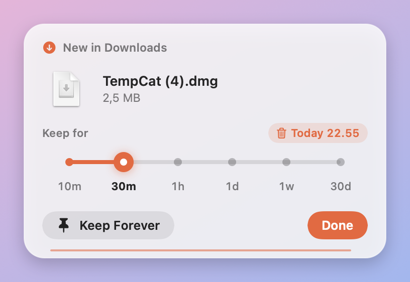
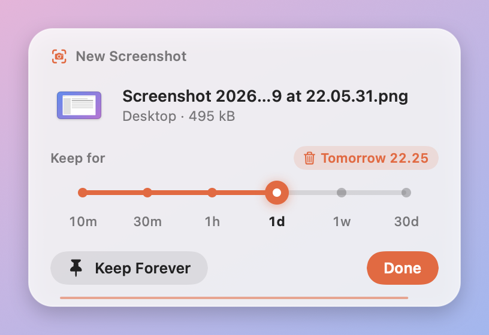
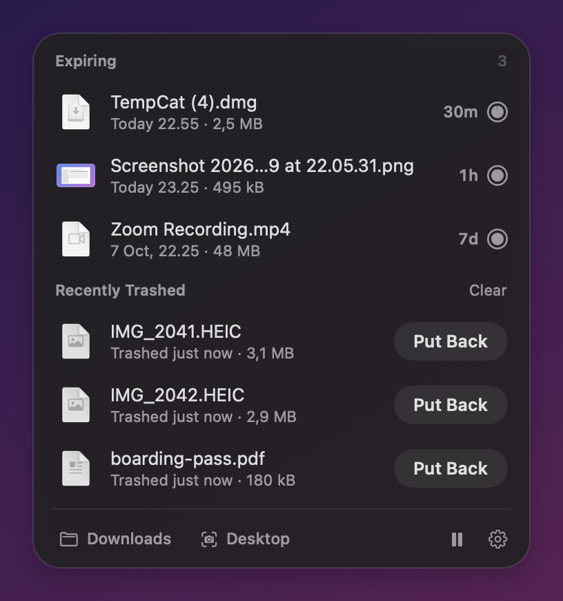

<p align="center"></p>

# Pumpkin 🎃

**Every file gets its midnight.**

Your Downloads folder called. It wants its floor back.

Pumpkin is a tiny, free, open-source macOS menu bar app for the files you need *right now* — downloads, screenshots, that installer you opened once. Give each one an expiry time. Pumpkin moves it to the Trash when its time is up.

Keep the important stuff forever. Put anything back if you change your mind.

<p>
  
  
</p>

## Get Pumpkin

Requires **macOS 14 or later**. The release app contains both **Apple Silicon and Intel** binaries.

1. Download `Pumpkin-1.0.0-macOS.zip` from [GitHub Releases](https://github.com/baogli/pumpkin/releases/latest).
2. Unzip it and drag `Pumpkin.app` into Applications.
3. Open Pumpkin. The welcome screen helps you grant Downloads and screenshot-folder access.
4. Look for the little pumpkin in your menu bar.

The 1.0.0 community binary is **ad-hoc signed and not Apple notarized**. macOS may block its first launch. Review the app and follow [Apple’s instructions for opening an app from an unidentified developer](https://support.apple.com/en-ie/102445), or build it from source. The project does not require disabling Gatekeeper.

## How it works

- **Download or take a screenshot.** A small question appears below the menu bar, with the file name and a preview when available.
- **Pick its midnight.** Choose 10 minutes, 30 minutes, an hour, a day, a week, or 30 days. Press **Done**, or **Keep Forever**.
- **Let Pumpkin tidy up.** Expired files go to the Trash. Click **Put Back** to restore them.
- **Change your plans.** Click the menu bar icon to adjust timers or keep a file. Right-click for **Pause**, **Settings**, and **Quit**.

The menu bar ring drains as the next file’s expiry approaches. Pause freezes timers; resuming shifts them by the paused duration. Settings can start Pumpkin at login, change the watched download folder, switch screenshot watching off, and control unanswered prompts. By default, an unanswered prompt keeps the file.

Once you click a question: **← →** pick a time, **Return** confirms, **K** keeps forever, and **Esc** dismisses it.

<p></p>

## Your files stay yours

Pumpkin runs locally. No accounts, telemetry, cloud uploads, or network requests.

- Files already in a folder on first launch are left alone. On later launches, Pumpkin can ask about files that arrived while it was closed, up to three days back.
- Only real macOS-tagged screenshots are watched in the screenshot folder; ordinary Desktop files are left alone.
- A file is moved to the Trash only while it is still the same file, identified by its inode, directly inside the folder where you set its timer. Renames are followed. Move it elsewhere, including a subfolder, and Pumpkin leaves it alone.
- Unfinished downloads such as `.crdownload`, `.part`, and `.download` are ignored until they finish.
- Pumpkin never empties the Trash. Restoration remains available while the item is still there.

## Build from source

Use **Xcode 26 or later** and its Command Line Tools. The SDK is needed to compile the macOS 26 glass UI; the resulting app also includes the macOS 14–15 UI fallback.

```bash
swift test
scripts/build.sh
open dist/Pumpkin.app
```

The build produces a universal, ad-hoc-signed `dist/Pumpkin.app`. To package it:

```bash
scripts/package-release.sh
```

This creates the ZIP and `release/SHA256SUMS`. To sign with your own Developer ID, set `SIGN_IDENTITY="Developer ID Application: …"` when running `scripts/build.sh`. Notarization is a separate distribution step.

Recreate the original pumpkin icon with `swift scripts/make_icon.swift Resources`.

## Development and tests

There are no third-party Swift package dependencies.

| Path | Purpose |
| --- | --- |
| `Sources/PumpkinCore` | Folder watching, finished-download and screenshot detection, expiry, Trash, restoration, and persistence |
| `Sources/PumpkinApp` | App model, AppKit menu bar and panels, SwiftUI onboarding and settings |
| `Sources/Pumpkin` | Application entry point |
| `Sources/PumpkinQA` | Real app-model/UI checks and light/dark snapshots using temporary demo files |
| `Tests` | Core logic and upgrade/settings migration tests |
| `media/launch` | Announcement MP4, portable editable composition, fonts, and launch copy |

```bash
swift test
swift run PumpkinQA qa-output
```

The 1.0.0 release was checked locally on macOS 26.5.2 with Xcode 26.6: **60 tests and 80 end-to-end/UI checks passed**. The QA app uses temporary folders and the real Trash, restores its test files, and leaves ordinary user folders alone. UI checks require a local macOS graphical session. The CI workflow builds/tests/packages on a macOS 26 runner; local results do not imply a completed hosted CI run.

State lives in `~/Library/Application Support/Pumpkin/state.json`. Preferences use the `app.pumpkin.Pumpkin` defaults domain.

Upgrading from the earlier local ShelfLife version: quit it before starting Pumpkin. Pumpkin copies its timers and imports its preferences once, retaining the original state as a backup. Existing Pumpkin preferences take precedence. Because the bundle identifier changed, macOS may ask for folder permissions again; configure **Open Pumpkin at login** in Settings and turn off the old login item if previously enabled.

## The 21-second version

[Watch the announcement video](https://github.com/baogli/pumpkin/releases/download/v1.0.0/Pumpkin-launch.mp4) · [Storyboard](media/launch/Previews/Filmstrip.png) · [Editable Tesseract source](media/launch/Pumpkin.tsrct)

The video uses actual Pumpkin panels with synthetic demo files and accelerated example timers. The artwork is AI-generated; typography and animation remain editable. See [launch materials](media/launch/README.md).

## Pumpkin 2.0 design specification

The next version is planned to bring screen recording, recent clipboard text, and file expiry into one app. The [designer handoff pack](docs/v2/README.md) contains the proposed product behavior, screens and states, integration requirements, and acceptance criteria (in Russian).

This is a specification for design and later implementation. The current 1.0 release provides file expiry; the combined 2.0 app has not been built or released yet.

## License

[MIT](LICENSE). Use it, change it, share it. Third-party font licenses and artwork provenance are listed in [THIRD_PARTY_NOTICES.md](THIRD_PARTY_NOTICES.md).
