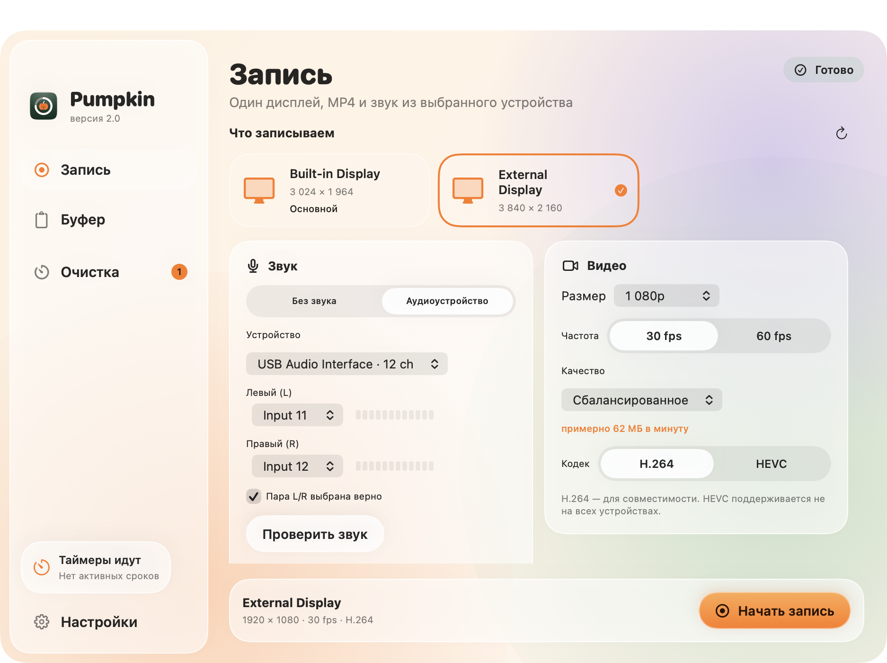

# Pumpkin 2.0 — продукт, дизайн и реализация

Статус: **реализована объединённая версия для локальной проверки**. Обновлено 1 октября 2026 года. Стабильный публичный релиз пока 1.0; аппаратная приёмка 2.0 перечислена отдельно.

Pumpkin становится одним бесплатным приложением для macOS: записать экран со звуком, вставить недавно скопированный текст, назначить срок жизни скачанному файлу или скриншоту. Один значок в строке меню, общие настройки и самостоятельная работа каждого модуля.

Дизайн из ветки `claude/dazzling-cannon-8bma0t` согласован пользователем и реализован нативно. Запись интегрирована на основе MIT-кода Able Recorder; история буфера реализована самостоятельно по спецификации. Исходный дизайн и требования сохранены для сверки.

## Порядок чтения

1. [Продуктовая спецификация](PRODUCT_SPEC.md) — функции, границы версии, поведение и сценарии.
2. [Задание дизайнеру](DESIGN_BRIEF.md) — структура интерфейса, экраны, состояния, компоненты и формат передачи дизайна.
3. [Технические требования и приёмка](IMPLEMENTATION_NOTES.md) — исходные программы, ограничения, интеграция и проверка будущей реализации.
4. [Дизайн «Liquid Glass»](design/README.md) — 24 артборда, дизайн-система и токены; согласован.
5. [Реализация и проверки](TESTING.md) — структура кода, результаты QA и оставшаяся аппаратная приёмка.
6. [Исправления ревью](REVIEW_FIXES.md) — двойной буфер, гонки вставки, сохранение вопросов, независимые скриншоты и записи в Корзине; preview 2 / build 3.

## Состав согласованного дизайна

- Редактируемый макет macOS-приложения: основное окно, меню Pumpkin, быстрый буфер у текстового курсора, запрос срока хранения, настройки и онбординг.
- Полные сценарии записи, вставки из истории, назначения таймера и восстановления из Корзины.
- Состояния разрешений, пустых списков, отсутствующих устройств, записи, завершения MP4 и ошибок.
- Светлая и тёмная темы, компоненты и их варианты, спецификация поведения с клавиатуры.

В реализации сохранены три раздела, общий glass-контейнер, светлая/тёмная темы, собственные записи бессрочно и самостоятельные разрешения. Кнопка начала записи закреплена снизу; при минимальной ширине карточки звука и видео складываются вертикально, чтобы номера L/R оставались читаемыми. Конкретные значения каналов в макете не являются настройкой пользователя.

## Основные решения

| Область | Решение для 2.0 |
| --- | --- |
| Название | Pumpkin; названия Vee и Able Recorder остаются в сведениях об исходном коде |
| Платформа | macOS 14+, нативное приложение; Apple Silicon и Intel — цель с отдельной проверкой записи на обеих архитектурах |
| Запись | Один выбранный дисплей, MP4, звук из выбранного Core Audio устройства с явным выбором L/R |
| Буфер | Недавний текст, до 60 элементов в памяти; быстрый вызов ⌥⌘V |
| Очистка | Downloads и настоящие скриншоты macOS; срок → Корзина → возможность вернуть |
| Собственные видео | Сохраняются бессрочно; очистка только после явного назначения таймера |
| Приватность | Локально, без аккаунта, телеметрии, загрузки файлов и облачной синхронизации |
| Лицензия | MIT для Pumpkin; лицензирование переносимого кода проверяется до интеграции |

Сборка этой ветки: `scripts/build.sh`, затем `open dist/Pumpkin.app`. [Релиз 1.0](https://github.com/baogli/pumpkin/releases/tag/v1.0.0) остаётся стабильным выпуском. Локальная universal-сборка 2.0 не означает завершённую приёмку звука Ableton, внешнего монитора и Intel runtime.

## Интерфейс реализации

Вымышленные данные QA; номера каналов и внешний дисплей в снимках подставлены для проверки интерфейса.

[Тёмная тема](screenshots/recording-dark.png) · [Буфер](screenshots/clipboard-light.png) · [Очистка](screenshots/cleanup-light.png) · [Быстрый буфер](screenshots/quick-clipboard.png) · [Вопрос о сроке](screenshots/expiry-prompt.png) · [Меню](screenshots/menu.png) · [Минимальное окно](screenshots/recording-minimum.png)
