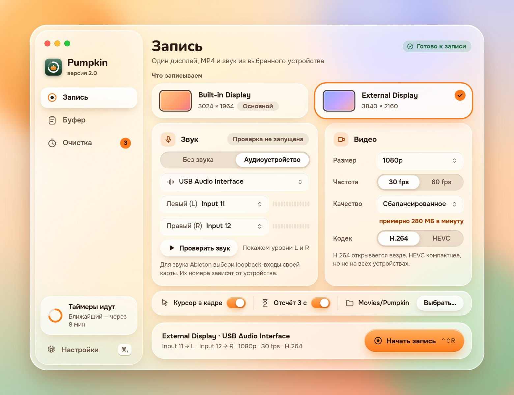

# Pumpkin 2.0 — дизайн «Liquid Glass»

Статус: **согласованный исходный макет; реализован как development preview**. Дата: 2026-10-01. Основан на [продуктовой спецификации](../PRODUCT_SPEC.md) и [задании дизайнеру](../DESIGN_BRIEF.md). Canvas и описания дизайн-этапа сохранены; текущие доказательства реализации и аппаратная приёмка — в [TESTING.md](../TESTING.md).

## Идея

Тёплое стекло. Окно, меню и popup — это стекло поверх цветного фона, а содержимое лежит на спокойных панелях и всегда читается.

- **Цвета берём у тыквы и иконки**: оранжевый — действие и выбор, лесной зелёный — бренд и «всё хорошо», красный — только запись и опасное действие.
- **Стекло держит рамку, а не содержимое.** Размытие только у окна и popup; вложенные панели — тон и блик, без второго размытия.
- **Тыква — в приветствии, пустых состояниях и коротких «готово»**. В записи, выборе файла и ошибках — только информация и ясные действия.
- **Светлая и тёмная темы равноправны.** Тёмная — «ночная грядка»: лес, слива и тёплый огонёк.
- **Статус никогда не только цветом**: иконка и слово. Красная точка записи, пауза, тишина и ошибка устройства различаются текстом.

Подробно: цвет, материалы, слои, типографика, иконки и тыква — в [Foundations](previews/Foundations.jpg); все компоненты и их состояния — в [Components](previews/Components.jpg).

## Экраны

Все размеры в pt: главное окно 920 × 700, настройки 800 × 740, онбординг 760 × 660–700. Названия соответствуют формату `P03 / Запись / Состояние` из задания.

| ID | Экран | Файл |
| --- | --- | --- |
| P01 | Знакомство и выбор функций (в том числе вариант обновления с 1.0) | [P01-welcome](previews/P01-welcome.jpg) |
| P02 | Доступы: разрешено / нужен перезапуск / нужен доступ / не запрошено | [P02-access](previews/P02-access.jpg) |
| P03 | Запись: настройка — готово | [P03-record-ready](previews/P03-record-ready.jpg) |
| P03 | Запись: проверка звука идёт, тёмная тема | [P03-record-testing-dark](previews/P03-record-testing-dark.jpg) |
| P03 | Запись: нет устройства и отключён сохранённый дисплей | [P03-record-missing-device](previews/P03-record-missing-device.jpg) |
| P04 | Запись: отсчёт | [P04-countdown](previews/P04-countdown.jpg) |
| P05 | Запись: идёт запись, предупреждение о тишине | [P05-recording](previews/P05-recording.jpg) |
| P05 | Запись: «Сохраняем MP4…» | [P05-finalizing](previews/P05-finalizing.jpg) |
| P06 | Результат и собственные записи (бессрочно, таймер, недоступен, промежуточный файл) | [P06-result](previews/P06-result.jpg) |
| P07 | Буфер: история с превью | [P07-clipboard](previews/P07-clipboard.jpg), [тёмная](previews/P07-clipboard-dark.jpg) |
| P07 | Буфер: пусто | [P07-clipboard-empty](previews/P07-clipboard-empty.jpg) |
| P08 | Быстрый popup у курсора: вставка, только копирование, пусто, пауза | [P08-quick-paste](previews/P08-quick-paste.jpg) |
| P09 | Очистка: ожидают решения, таймеры, Корзина | [P09-cleanup](previews/P09-cleanup.jpg) |
| P09 | Очистка: таймеры на паузе, ошибка перемещения, восстановление под новым именем, тёмная | [P09-cleanup-paused-dark](previews/P09-cleanup-paused-dark.jpg) |
| P10 | Запрос срока: файл, скриншот, группа, собственная запись | [P10-keep-for](previews/P10-keep-for.jpg) |
| P11 | Меню Pumpkin: обычное и во время записи | [P11-menu](previews/P11-menu.jpg), [запись](previews/P11-menu-recording-dark.jpg) |
| P12 | Настройки: модули, горячие клавиши, конфликт | [P12-settings](previews/P12-settings.jpg), [тёмная](previews/P12-settings-dark.jpg) |
| P13 | Уведомления и диалоги: возврат из Корзины, выход во время записи, сбой сохранения, устройство отключилось | [P13-notices](previews/P13-notices.jpg), [тёмная](previews/P13-notices-dark.jpg) |

## Какие состояния где закрыты

| Состояние из задания | Экран |
| --- | --- |
| Разрешение не запрошено / дано / нужен доступ / нужен перезапуск | P02 |
| «Позже» не блокирует функции; «Без звука» не требует Microphone | P01, P03 |
| Дисплей отключён, устройство отсутствует, запись недоступна с причиной | P03 / нет устройства |
| Проверка звука: сигнал, тишина, пик, устройство недоступно | P03 (тёмная), P05, Components |
| Отсчёт и отмена; нет ложного «Записываем» до старта | P04 |
| Идёт запись, тишина на входах, источник и формат закреплены | P05 |
| Финализация; повтор не запускает новую запись | P05 / сохраняем, Components |
| Сохранено; недоступен файл; промежуточный `.partial.mp4` | P06, P13 |
| Устройство отключилось, но файл сохранён; сохранить не удалось | P13 |
| Буфер: пусто, список, пауза, длинная ссылка, код, многострочный, emoji, длинное слово | P07, P08 |
| Без Accessibility: «Скопировать», «Скопировано — вставь ⌘V» | P08, P13 |
| Запрос срока: файл, скриншот, группа, собственная запись | P10 |
| Таймеры: скоро истекает, пауза, ошибка Корзины, возврат, занято имя | P09, P13 |
| Конфликт горячей клавиши, отключённый модуль | P12 |
| Выход во время записи, очистка истории | P13 |
| Значок в строке меню: обычный, таймер, пауза, запись, сохраняем, нужен доступ | Components |

## Прототип

В холсте связаны навигация (сайдбар) и основной поток записи: **P03 → P04 → P05 → P06 → «Новая запись»**. Число на экране отсчёта — ссылка на следующий экран, только для прототипа. Остальные сценарии (F03–F07) показаны отдельными экранами без переходов между ними.

## Материалы и режимы системы

Экраны нарисованы для **macOS 26 (Liquid Glass)**. Для macOS 14–15 и для «Уменьшить прозрачность» в [Foundations](previews/Foundations.jpg) показаны образцы материалов: те же тон, радиусы и контраст, но стандартный материал или сплошная подложка. Раскладка при этом не меняется.

## Что не сделано

- Нет файла Figma: макет сделан как холст Claude Design. Исходники лежат в [`canvas/`](canvas) (формат `.dc.html` + `canvas.json`).
- Шрифты Nunito и Onest — подстановка для макета; в приложении предполагаются системные SF Pro / SF Rounded.
- Английская локализация не проверена: макеты на русском.
- Анимации и VoiceOver описаны правилами в Foundations и Components, покадровых спецификаций нет.
- Контраст проверен расчётом для основных пар (текст, кнопки, статусы), автоматического аудита не было.
- Реализации нет.

## Что нужно согласовать

Изменений продуктовой логики нет. Дизайнерские решения, которые стоит подтвердить:

1. На экране записи показывается, куда сохранится файл и что он будет храниться бессрочно (P05).
2. «Оставить навсегда» всегда видна текстом в строках очистки, а не прячется в меню (P09).
3. Для группы файлов в списке ожидающих — один срок на всех, как в спецификации (P09, P10).
4. Для собственной записи в запросе срока ни один срок не выбран заранее; «Назначить срок» активна только после выбора (P10).
5. Стандартные диалоги macOS (выбор папки, системные запросы доступа) здесь не рисуются — только диалоги Pumpkin (P13).

## Файлы

- [`previews/`](previews) — снимки всех экранов (JPEG, 1,5×).
- [`canvas/`](canvas) — исходники макета.
- [`tokens.json`](tokens.json) — цвета, материалы, радиусы и типографика для реализации.
